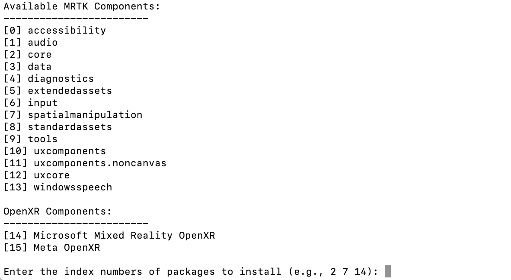

# Mixed Reality Feature Tool for Mac

## Overview
At the moment, if you want to use Mixed Reality Toolkit 3 (MRTK 3) for Unity on a Mac, you would have to download the Mixed Reality Feature Tool on a Windows machine to configure the Unity project. However, MRTK is a cross-platform Unity library, so there is no reason why someone using a Mac should have to use a Windows machine just to configure the Unity project with the Mixed Reality Feature Tool.

The Mixed Reality Feature Tool for Mac is a command-line tool that allows developers to download the necessary MRTK3 components on macOS. 

This tool is provided as a CLI tool that runs in the terminal and a GUI tool in both C++ and Python versions.

## C++ Version

### Requirements
- CMake

### Dependencies

```bash
brew install wxwidgets
brew install libarchive
```


### Build
To build the C++ version, follow these steps:
```bash
git clone https://github.com/stytim/Mixed-Reality-Feature-Tool-For-Mac.git mrfeaturetool
cd mrfeaturetool
mkdir build && cd build
cmake ..
make
```

### Usage
To use the C++ version, run in your terminal from the build directory:
```bash
./mrtk_cli path-to-your-Unity-project
```
or use the gui version
```bash
./mrtk_gui
```

## Python Version 

### Requirements 
Install the required packages using pip:
```bash
pip install requests packaging customtkinter
```
### Usage 
To use the Python version, run in your terminal: 
```bash
python core_logic.py path-to-your-Unity-project 
```
or use the gui version
```bash
python gui_tool.py
```

## Usage

The CLI tool will try to retrive the list of the MRTK 3 components. Select the MRTK3 components you want to import by typing the index numbers separated by a space. Press Enter to finish. 
<p align="left">
	
</p>


The GUI version is simialr to the offical Mixed Reality Feature Tool GUI.
<p align="left">
	
</p>

The tool will automatically download the selected components with the latest version, along with their dependencies.

## License
The Mixed Reality Feature Tool for Mac is licensed under the MIT License.
